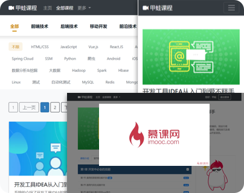
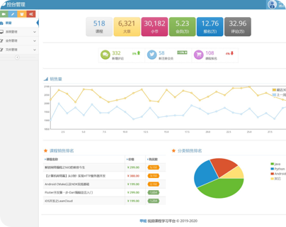
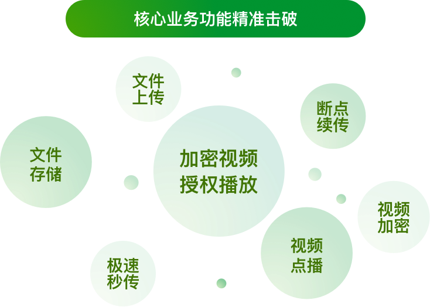
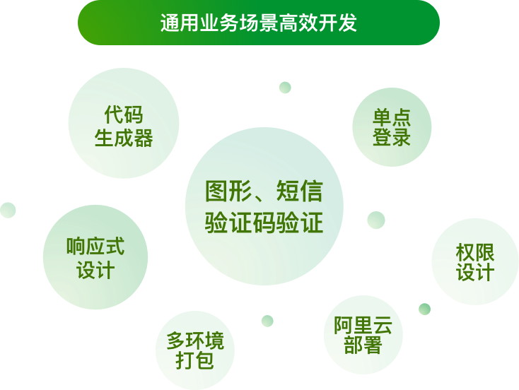
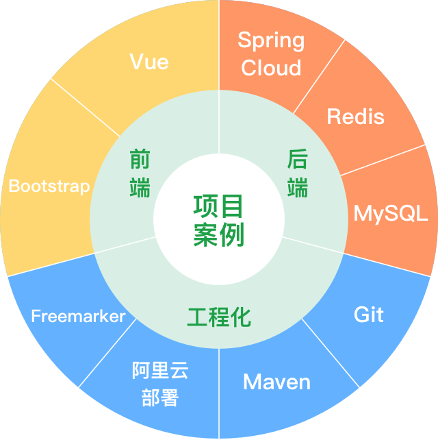

# Spring Cloud+Vue前后端分离开发企业级在线视频系统

> 课程用当下热门的Spring Cloud和Vue，带你一起开发企业级的在线视频课程系统，了解视频学习系统的核心业务特色，用一门课程掌握前后端技术，并拥有专属于自己的高质量线上作品。

# UI展示

- 项目前台视频学习网站展示（一套代码，多端适配）

- 管理后台效果展示

# 业务场景

# 技术框架

## 引用

1. 课程地址: [https://coding.imooc.com/class/416.html](https://coding.imooc.com/class/416.html)

